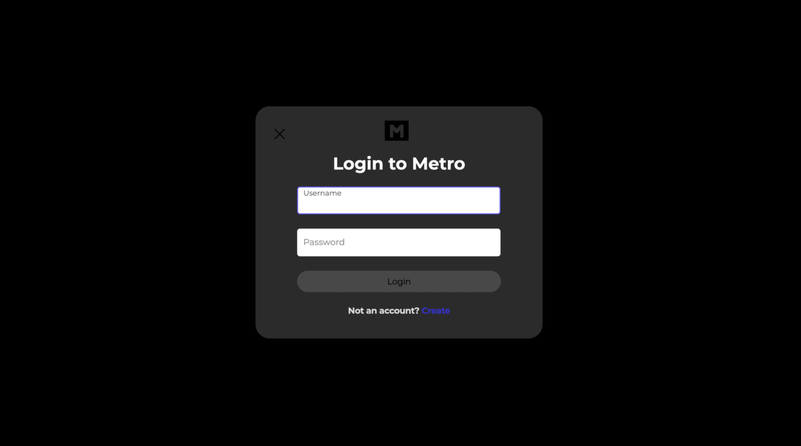
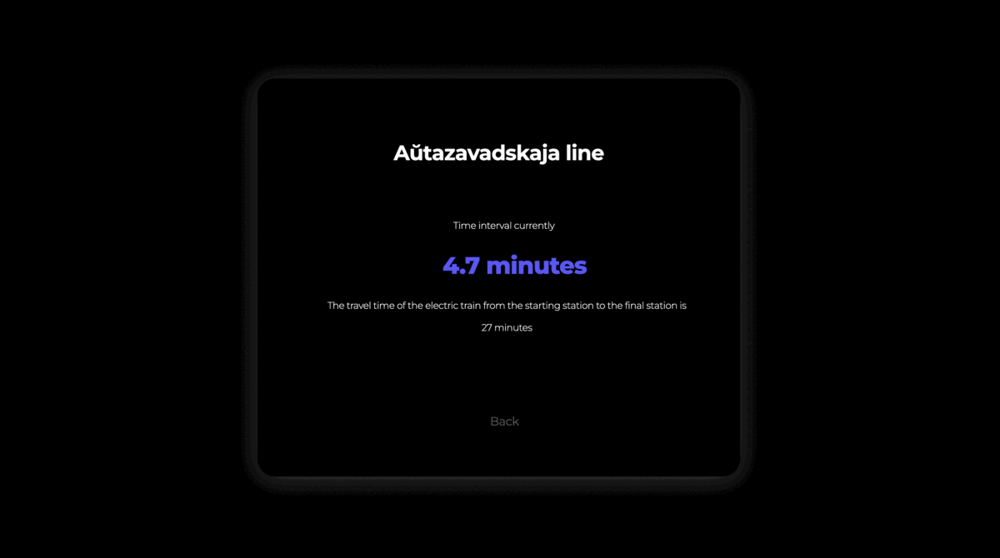
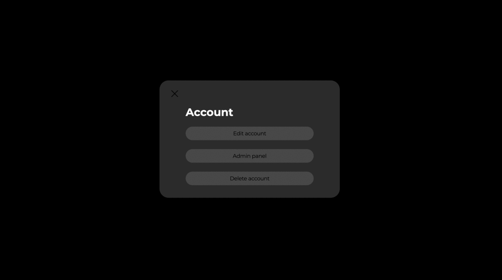
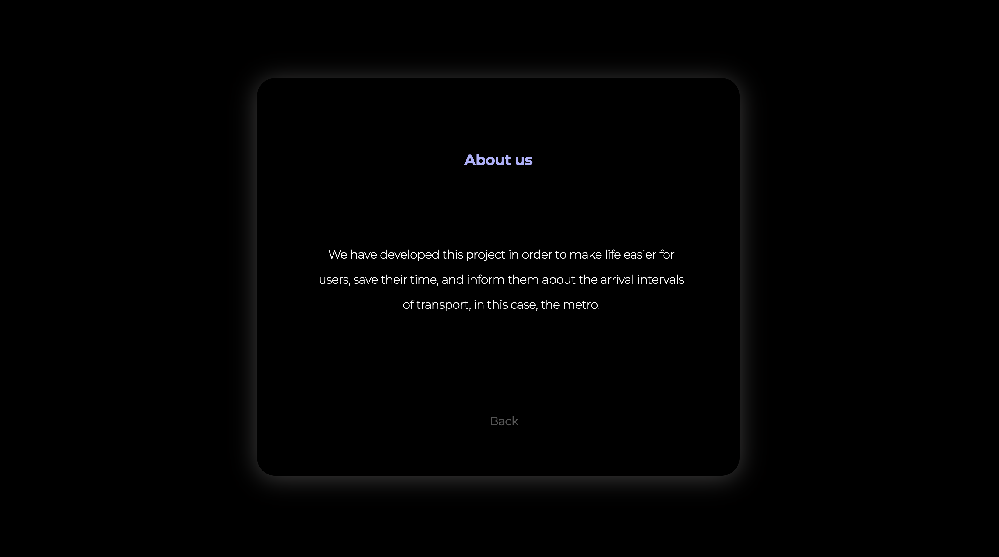

# Metro

***Save time and find out the interval of the metro in your city.***

*[Technical specification](docs/Specification-metro.md)*

### Screenshots

> Main page

The application is divided into *several functional blocks*.  
The main *navigation* of the system takes place on the **main page**, 
such as the selection of the *metro line*, the transition to *editing/deleting the account.*

> Login/Registration

> Lines

In this module, the User learns the traffic schedule on the 
selected line, as well as the total time required to travel it.  
**The required time is taken taking into account real time.**

> Account

In this module, the User can change the basic information about 
himself or delete the account.

> Additional 

In this module, you can find information about the System.

